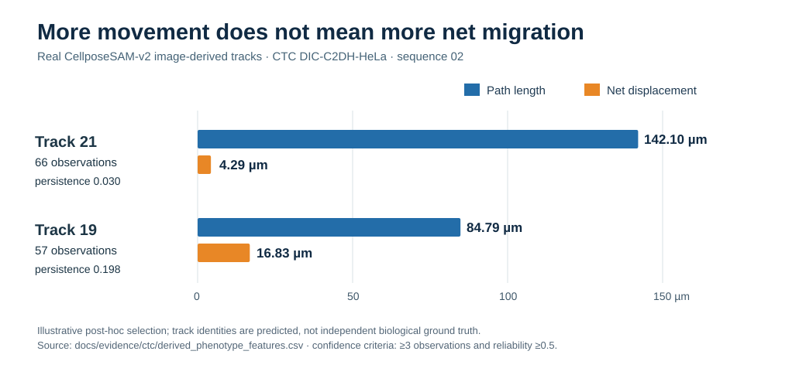

# Temporal Cellular Phenotype Engine

## Submission Links

**Category: End-to-End System**

**Code repository:** https://github.com/chrishotza/ai4s-life-science-2026

**Team (draft):** Chris Hotza, team leader (1 listed member; synchronize with the official registration before submission).

**Public narrated demo video:** https://www.kaggle.com/datasets/chrishotza/ai4s-2026-temporal-cellular-phenotype-demo (91-second MP4 with ElevenLabs narration; verified publicly accessible without login on October 9, 2026). Video images depict the separately exported CellposeSAM-v2 8-frame visualization pilot; the 168-frame measurements reported below come from a different completed evaluation run. The legacy renderer is `scripts/make_demo_video.py` and does **not** represent this narrated V10 cut.

**Technical report (public PDF, 17 A4 pages):** https://github.com/chrishotza/ai4s-life-science-2026/releases/download/ai4s-2026-technical-report/AI4S_Temporal_Cellular_Phenotype_Technical_Report.pdf. [Original report source](TECHNICAL_REPORT.md). Rendered and released by the [verified GitHub Actions run](https://github.com/chrishotza/ai4s-life-science-2026/actions/runs/38004917827).

## Project Summary

A cell can travel a long distance without migrating far from its starting point. That distinction matters in time-lapse microscopy: a segmentation mask tells a researcher where a cell is, but not whether its movement is sustained, wandering, or too poorly observed to interpret. Our Temporal Cellular Phenotype Engine turns raw microscopy into reproducible per-cell histories and transparent behavioral measurements.

We did not train a new foundation segmentation model. Instead, we integrated pretrained CellposeSAM-v2 predictions with physically calibrated, deterministic cell tracking, trajectory-feature extraction, candidate lineage analysis, descriptive grouping, and confidence gates that prevent unsupported interpretation. The result is an inspectable workflow from images to research hypotheses rather than another isolated segmentation score.

In an internal image-derived evaluation across 168 raw DIC-C2DH-HeLa frames, the system achieved segmentation F1 **0.9354**, detection F1 **0.9684**, and temporal-link F1 **0.9808**. Reference annotations were used for scoring, not supplied as detections. The outputs included 126 trajectory profiles; 51 were eligible for descriptive computational reporting, 21 were low-confidence descriptive, and 54 remained audit-only.

A real example shows why the temporal layer matters: one measured track accumulated **142.10 µm** of movement yet displaced only **4.29 µm** overall. Such differences can guide which cells deserve further review, but they do not establish biological cell states. Results are internal protocol measurements, not official Cell Tracking Challenge rankings. Drug-response and independent biological-phenotype validation remain future experiments; organ-on-a-chip data remains untested.

## From cell tracking to dynamic phenotype

### A concrete life-science research use case — observed, not hypothetical

**Question:** Which cells move actively but achieve little net displacement? A frame-wise mask or unannotated track ID cannot show the difference between traveled distance and sustained directional movement.

In the completed 168-frame **image-derived** CTC experiment, two post-hoc selected predicted tracks in sequence 02 give a concrete example:

| Track | Frames observed | Total path (µm) | Net displacement (µm) | Directional persistence | Reliability |
|---|---:|---:|---:|---:|---:|
| **21** | 66 | **142.10** | 4.29 | 0.030 | 0.607 |
| **19** | 57 | 84.79 | **16.83** | 0.198 | 0.625 |

Persistence here is **net displacement / traveled path**, a simple measure of how consistently motion translates into directional progress. Track 21 traverses more distance but ends closer to its start; track 19 travels less but advances further overall. Both pass the documented minimum-history and reliability gates for *descriptive computational* measurements.



**What this proves:** the temporal feature layer provides a measurable answer to a useful single-cell research question. **What it does not prove:** biological cell identity, treatment effect, independent phenotype labels or statistical significance. The tracks were chosen as illustrations, not a random cohort. Source: [real measured table and interpretation limits](CTC_REAL_MOTILITY_CASE_STUDY.md).

**Our innovation:** pretrained CellposeSAM-v2 supplies image segmentation; we contribute physically calibrated tracking, temporal descriptors, data-quality gates and reproducible evidence reporting. For future state predictions, *past-only* means no later frames are used to predict earlier ones; this is protection from temporal leakage, not proof of biological causation.

### Problem

Time-lapse microscopy captures rich cellular behavior, but conventional pipelines often stop at segmentation or tracking. A track ID tells us where a cell went; it does not directly describe how the cell behaved.

The goal of this project is to turn temporal microscopy into an interpretable **single-cell phenotype representation**.

### Approach

The system is organized as an end-to-end pipeline:

1. microscopy frame preprocessing;
2. cell detection;
3. temporal association;
4. 3-D trajectory reconstruction;
5. lineage and division-event inference;
6. temporal phenotype extraction;
7. unsupervised phenotype discovery.

The submission implementation is deliberately deterministic and reproducible.

### What is novel about the submission

The main contribution is not another isolated tracker. Tracking is treated as infrastructure for a downstream phenotype layer.

For each trajectory, the engine derives:

- duration;
- displacement;
- path geometry;
- mean speed;
- directional persistence;
- parent/child relationships;
- division events;
- descendant structure.

These features form a compact temporal phenotype profile that can be clustered into interpretable behavioral groups.

### End-to-end implementation boundary

The public engine provides a canonical image-to-phenotype path through baseline detection, while the real CTC experiment intentionally bypasses segmentation by using reference centroids. This separation makes the quantitative association result interpretable instead of presenting a centroid benchmark as an image-segmentation score.

### Image-level validation track

The submission now includes a separate cross-sequence holdout protocol that starts from the raw DIC-C2DH-HeLa microscopy rather than reference centroids. Detector settings are selected on one sequence and evaluated on the other. A second validation layer compares the transparent segmentation baseline against the available CTC GT/SEG instance annotations. These experiments are kept separate from the published association-isolation headline so that segmentation, tracking, and downstream phenotype evidence cannot be conflated.

The completed supervised DIC-C2DH-HeLa holdout is weak: mean frame-wise instance F1 at IoU ≥ 0.5 is **0.09155**, image-derived detection F1 is **0.37728**, and temporal-link F1 is **0.09716**. The benchmark completed in [Actions run 37907638057](https://github.com/chrishotza/ai4s-life-science-2026/actions/runs/37907638057) and uploaded [its evidence artifact](https://github.com/chrishotza/ai4s-life-science-2026/actions/runs/37907638057/artifacts/11605411442). These numbers are a diagnostic result, not evidence of competitive image-to-phenotype accuracy. A distinct strict temporal holdout reported segmentation F1 **0.14942**, detection F1 **0.43454**, tracking-edge F1 **0.30197**, and sparse-gold object recall **0.1132**; it failed its predefined quality gate. Its [artifact](https://github.com/chrishotza/ai4s-life-science-2026/actions/runs/37907133446/artifacts/11605019590) is reported separately because its temporal-split protocol differs.

The separate PhC-C2DL-PSC supervised image-segmentation holdout was rerun on current `main` (commit [`6d7bbc4`](https://github.com/chrishotza/ai4s-life-science-2026/commit/6d7bbc4ad4fece809b0752166230aeafc732a698)). Across 40 held-out silver-mask frames in each direction, mean frame-wise instance F1 at IoU ≥ 0.5 was **0.22698** (precision 0.19856, recall 0.27859); the sparse gold cross-check scored F1 **0.39723** on only four frames total. The rerun reproduced the earlier weak result; this is reproducibility evidence for the segmentation benchmark, not an adequate end-to-end product score. [Actions run](https://github.com/chrishotza/ai4s-life-science-2026/actions/runs/37924623262) · [results and provenance artifact](https://github.com/chrishotza/ai4s-life-science-2026/actions/runs/37924623262/artifacts/11613811430).

A bounded pretrained Cellpose-SAM pilot then ran the first **4 frames per sequence (8 total)** through the product's TemporalPhenotypeEngine. Mean instance segmentation F1 at IoU ≥ 0.5 was **0.87490**, image-derived detection F1 **0.88810**, and tracking-edge F1 **0.89180**. The run also exported per-track temporal features, descriptive cluster assignments, and integrity/reliability diagnostics ([Actions run](https://github.com/chrishotza/ai4s-life-science-2026/actions/runs/37925893949); [results, phenotype CSVs, and provenance](https://github.com/chrishotza/ai4s-life-science-2026/actions/runs/37925893949/artifacts/11613698759)). This verifies that the real-image path produces downstream phenotype outputs, but eight opening frames are only an exploratory integration test, not a stable generalization estimate or validation against biological phenotype labels.

An earlier, separate Cellpose run reached mean per-frame segmentation F1 of **0.92903** on 40 sampled frames from sequence 01 and **0.94621** on 14 of 40 frames from sequence 02 before cancellation ([partial Actions log](https://github.com/chrishotza/ai4s-life-science-2026/actions/runs/37899689242)). It produced no aggregate artifact or complete downstream tracking/phenotype evaluation, so those longer partial means remain preliminary evidence.

### Real benchmark evidence

**Public evidence figure:** [three-layer CTC validation summary](https://github.com/chrishotza/ai4s-life-science-2026/blob/main/docs/figures/validation-evidence.svg). It separates reference-centroid association, the supervised image-derived holdout, and the eight-frame Cellpose-SAM pilot; these protocols are not directly comparable.

The system was evaluated on DIC-C2DH-HeLa sequences 01 and 02 from the Cell Tracking Challenge.

The association benchmark uses the reference centroids as detections, intentionally isolating temporal association from segmentation.

A physical-unit sweep compared mutual nearest neighbor, Hungarian assignment, and constant-velocity Hungarian association.

The best measured configuration was mutual nearest neighbor with an 8.0 µm gate:

- mean precision: **0.99135**
- mean recall: **0.99322**
- mean F1: **0.99228**

Per-sequence F1:

- sequence 01: **0.99308**
- sequence 02: **0.99149**

The improvement over the initial restrictive-gate baseline was substantial: mean F1 increased from approximately 0.9183 to 0.9923.

### External CTC TRA/LNK validation

The selected 8.0 µm MNN association path was also exported with the **reference CTC object geometry preserved** and evaluated with the pinned `py-ctcmetrics==1.3.3` implementation. The captured association-isolation results were:

- sequence 01: **TRA 0.997315**, **LNK 0.979091**;
- sequence 02: **TRA 0.997207**, **LNK 0.978239**.

These values are reported separately from the custom F1 because TRA/LNK and the repository's edge F1 are different metrics. They are not end-to-end segmentation results, not biological lineage validation, and **not official Cell Tracking Challenge leaderboard scores**. The official submission evaluator was not used. A no-oracle sensitivity control removed all reference parent edges and produced identical TRA/LNK values on both sequences.

### Downstream phenotype preservation

The selected tracker was then evaluated through the phenotype layer on the same real sequences.

For matched trajectories:

- mean trajectory coverage: **0.9451**
- median trajectory coverage: **1.0000**
- directional-persistence MAE: **0.0439**
- mean-speed MAE: **0.1206 µm/frame**

This experiment demonstrates reproducible preservation of trajectory-derived phenotype features.

It does **not** claim biological phenotype classification. That requires independent biological labels or perturbation annotations.

### Lineage and division evidence

The public phenotype layer also represents parent/child structure, division events, and descendant counts. A dedicated CTC validation benchmark now checks that these features reproduce the reference lineage annotations for sequences 01 and 02. This is a representation-level validation using the CTC reference lineage graph; it is not presented as an end-to-end biological division detector result.

The benchmark is executed in CI through scripts/benchmark_ctc_lineage.py, with exact child-count and descendant-count checks alongside division-parent precision, recall, and F1.

### Missing-observation robustness

We also stress-tested the temporal association layer under controlled synthetic detection dropout.

At 5% dropout, mutual-nearest-neighbor tracking fragmented 24 reference tracks, while the experimental bounded-gap Hungarian branch fragmented only 1. At 10% dropout the counts were 29 versus 7, and at 15% dropout 30 versus 19.

The corresponding phenotype-group ARI was also substantially better for the bounded-gap branch at 5% and 10% dropout (0.4879 vs -0.0184 and 0.3584 vs -0.0102). In the same runs, every measured gap link preserved reference identity.

A separate real-data association-isolation benchmark on CTC PhC-C2DL-PSC tested a two-frame-window `gap_hungarian` candidate on reference centroids. Its mean pairwise trajectory-identity F1 was 0.77858 in a two-way sequence holdout, versus 0.76879 for velocity Hungarian, but identity precision was lower (0.73855 vs 0.82554). This is not image-derived tracking or biological validation, so the candidate remains experimental rather than replacing the default tracker; full method/gate results and the direction-specific holdout are in [docs/RESULTS.md](RESULTS.md).

This branch remains experimental and is reported separately from the validated real-data CTC association result.

### Phenotype-discovery robustness

The phenotype layer was also stress-tested under controlled synthetic trajectory perturbations. Standard scaling + K-Means had the strongest measured stability among the tested configurations, with mean ARI 0.7839 and minimum ARI 0.5312 across the perturbation sweep. More complex robust-scaling variants were tested and rejected because they performed worse in this controlled experiment.

This is computational robustness evidence, not biological phenotype validation.

### Why this matters

The practical value of the system is the transition from:

**microscopy → track IDs**

to:

**microscopy → temporal cellular behavior → interpretable phenotype**

That representation can support motility analysis, state characterization, abnormal-behavior screening, lineage-aware studies, and downstream biological investigation.

### Reproducible product execution

The system can be run on an input sequence through `scripts/analyze_microscopy.py`. It accepts a TIFF stack or a directory of 2-D grayscale TIFF frames and writes observation/track tables, temporal links, candidate lineage edges, per-track phenotype tables, a machine-readable summary, and a visualization. Example:

```bash
python scripts/analyze_microscopy.py ./sequence --output ./analysis_output \
  --max-distance-um 5 --voxel-size-um 1 0.19 0.19 --clusters 3
```

The detector in this entry point is a transparent threshold/connected-component baseline. Its quality is data-dependent and it must not be interpreted as a universal microscope segmenter. The high CTC association-isolation numbers reported above use reference centroids and do not validate image-derived segmentation.

### Reproducibility

The repository contains:

- complete source code;
- public benchmark loader;
- deterministic synthetic tests;
- quantitative evaluation;
- Docker support;
- GitHub Actions CI;
- reproducible benchmark workflows;
- technical report;
- five-minute demo script.

The microscopy datasets are downloaded transiently for evaluation and are not redistributed in the repository.

### Limitations

The current public baseline has transparent limitations:

- threshold-based image segmentation is not universal;
- association can fail under severe crowding or missing detections;
- lineage events remain candidate inferences;
- unsupervised phenotype clusters are descriptive;
- CTC association results use reference centroids and are not a full image-to-phenotype score.

These limitations are explicitly reported rather than hidden.

### Future direction

The strongest next step is to validate the phenotype layer on an independently labeled biological perturbation dataset and compare temporal phenotype distributions between conditions.
